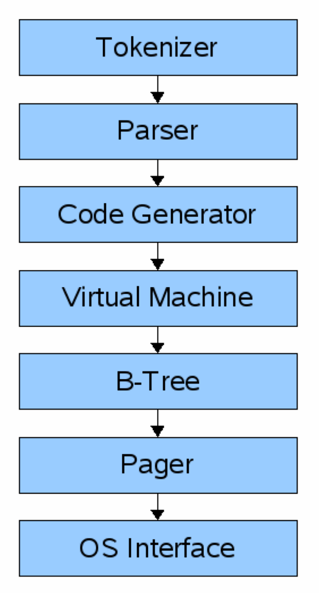

# TinyDB
一个 cstack / db_tutorial 的简单实现。

https://github.com/cstack/db_tutorial


在实现过程中在代码里加入了部分注释，有助于理解部分代码。下面是MarginNote导出整理的部分笔记。


## 组件



### 前端组件

前端组件的输入是一条SQL的查询。而输出是SQLite的虚拟机字节码(其本质上是可以在数据库上运行的已编译程序)。

- tokenizer
- parser
- code generator

### 后端组件

#### 虚拟机

虚拟机将前端生成的字节码作为指令。然后,它可以对一个或多个表或索引执行操作,每个表或索引都存储在称为B树的数据结构中。 VM 本质上是关于字节码指令类型的switch语句

 

#### B-Tree

 

- 每个B树由许多节点组成。每个节点的长度为一页。 B树可以通过向pager发布指令从磁盘获取页面或者存储页面到磁盘。
- 优点
  -   搜索特定值的速度快(指数级logarithmic time)
  - 插入/删除很快(constant-ish time to rebalance重新平衡的时间稳定)
  - 遍历很快(和HASH MAP相比)


不同于二叉树,每个B树的节点都可以有两个以上的孩子,每个节点都可以至多有M个孩子,我们称M为树的阶(order)。为了使树保持平衡,我们规定节点必须至少有M/2个孩子(向上取整)。 例外情况: 叶子没有子节点 跟节点的数量可以小于M,要大于等于2 如果跟节点是叶子节点(意味着整个B树只有一个节点)它的子节点数仍然为0

当树的阶数为3时： 每个内部节点最多有3个子节点 每个内部节点最多有2个键 每个内部节点最少有2个子节点 每个内部节点最少有1个键 

 

 

 

​     

 

##### 叶子节点

####  

 

 理论总存储量

 

 

##### 非叶子节点


 

为了让树平衡,我们在两个节点间平均分配单元。如果一个叶子节点可以承载N个单元,那么在整个过程中我们需要分配N+1个单元(N个初始单元加一个新单元)如果N+1为奇数,我们把它存在任意左侧节点。

即当n+1为奇时，左侧存 n /2 + 1个节点 

 

### Pager

pager接收命令以读取或写入数据页。它负责以适当的偏移量在数据库文件中进行读取/写入。它还在内存中保留了最近访问页面的缓存,并确定何时需要将这些页面写回到磁盘。

 

​         

 

使用VIM查看存储文件的样式

vim mydb.db 

 ```bash
:%!xxd 
 ```


 